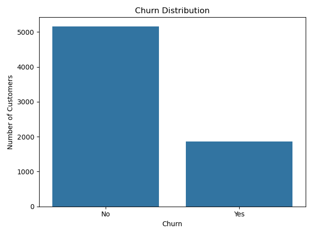
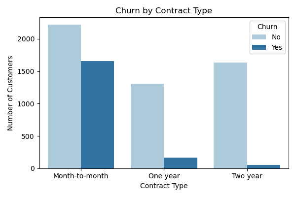
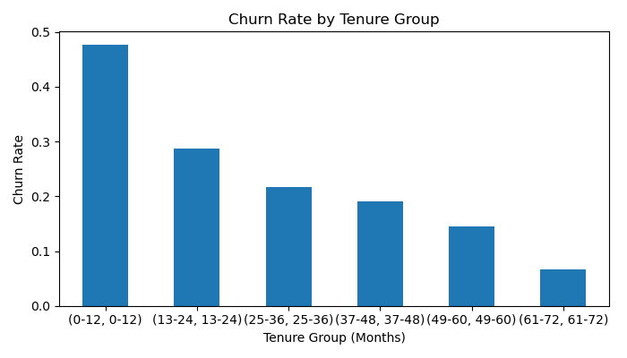
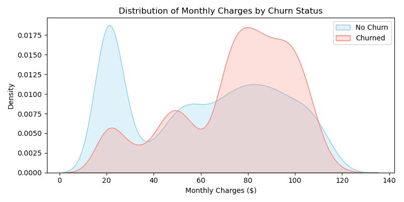
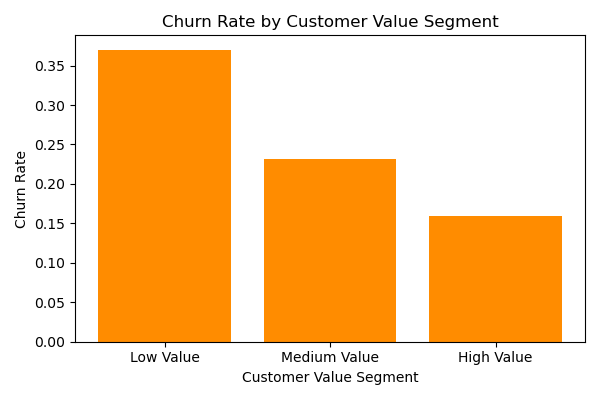

# Customer Churn Analysis – Telecom Case Study

This project explores customer churn behavior using a real-world telecom dataset. The goal is to simulate the work of a data analyst by uncovering patterns behind customer attrition and presenting actionable business insights using SQL and Python.

---

## Tools & Technologies

- **Python**: Data exploration & visualization
- **Pandas**: Data processing & segmentation
- **Seaborn / Matplotlib**: Visual storytelling
- **Jupyter Notebook**: Exploratory workflow

---

## Business Questions Addressed

1. What is the overall churn rate in the dataset?
2. Are certain contract types more prone to churn?
3. Does customer tenure influence churn likelihood?
4. Is there a correlation between monthly charges and churn?
5. Which customer value segments (based on TotalCharges) are most at risk?
6. What key groups should retention efforts focus on?

---

## Key Insights

- 📉 **Churn rate** is ~**[insert your actual churn % here]**, showing a clear class imbalance worth addressing.
- 📦 Customers on **month-to-month contracts** are **3–5x more likely** to churn than those on longer-term plans.
- ⏳ **Tenure** is strongly inversely correlated with churn — most churn happens within the first 12 months.
- 💰 Customers with **higher monthly charges** churn more, possibly due to pricing dissatisfaction.
- 💸 **Low-value customers** (< $1,000 in total charges) are the most churn-prone group.
- 🎯 Churn patterns point to **targeted retention strategies**: prioritize short-tenure, low-value, and high-bill customers.

---

## 📷 Visualizations

### 📉 Churn Distribution  


### 📝 Churn by Contract Type  


### ⏳ Churn by Tenure Group  


### 💰 Monthly Charges vs Churn  


### 🧮 Churn by Customer Value Segment  


---

## Project Structure

```
customer-churn-analysis/
├── CSV Exports/
├── notebooks/
│ └── Churn_Analysis.ipynb
├── visuals/
│ ├── churn_distribution.png
│ ├── churn_by_contract.png
│ ├── churn_by_tenure.png
│ ├── monthly_charges_kde.png
│ └── value_segment_churn.png
├── README.md
```


---

## About the Dataset

Dataset: [Telco Customer Churn - Kaggle](https://www.kaggle.com/datasets/blastchar/telco-customer-churn)  
Rows: 7,043 | Features: 21  
Target: `Churn` (Yes/No)

---

## Author

**Pratyush Pranjal**  
https://linkedin.com/in/pratyushpranjal | pppranjalpratyush@gmail.com
